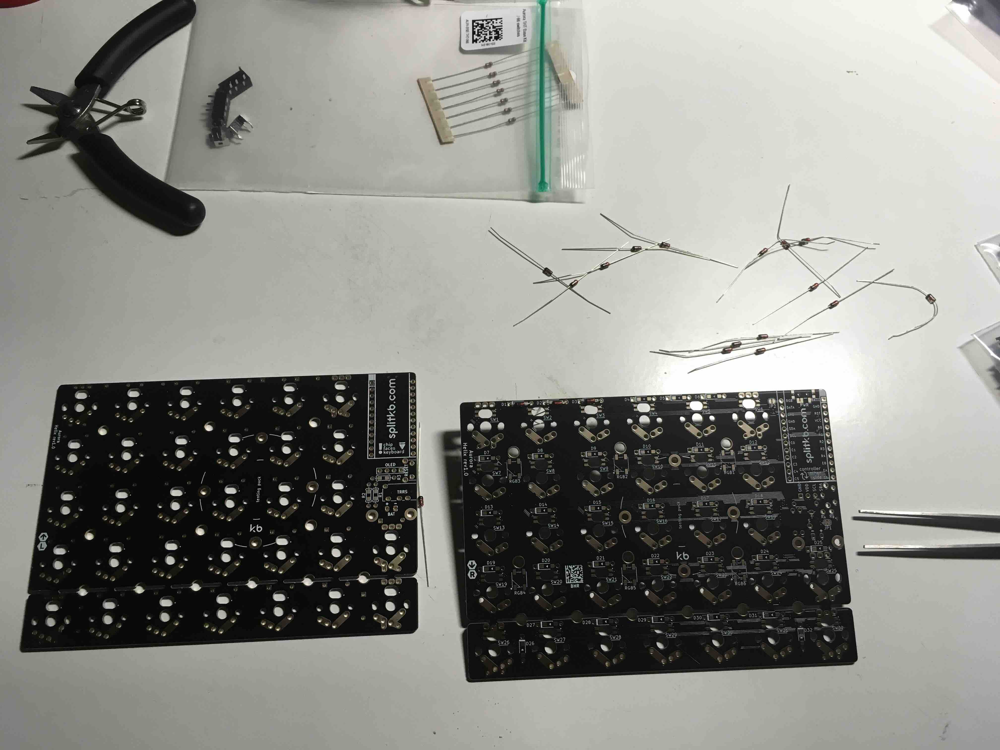

# SplitKB Aurora Helix
An ergonomic split keyboard with ortholinear grid layout, using Aurora Helix from [splitkb.com](https://splitkb.com)  
Here are the 3D design files for the keyboard case, including the top plates, bottom plates, controller covers, and molds for casting the bottom plates from epoxy. 
There's the complete 3D model in a FreeCAD file, the exported parts in STL files, and also Bambu Studio project files ready to print on a bambu printer. 
 
 
# Build log
 

